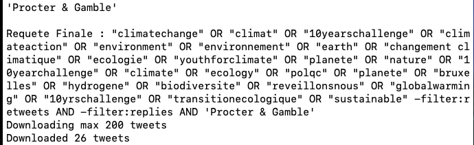
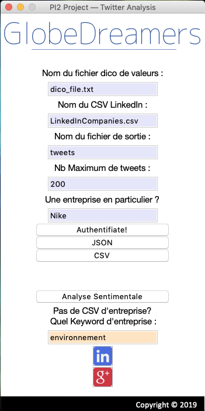

# Pi2_A5 - Project

This is a school project in partnership with a startup named Globedreamers.

Founded in 2016, GlobeDreamers is a fundraising platform for traveling. People can send their travel plan to the platform and raise fund from individuals or companies. GlobeDreamers allows companies to donate for a trip project in exchange of report, that can be used by the company to promote their brand or their commitment to a cause such as Global warming. GlobeDreamers wanted us to build a graphic interface to help them find a company that could be interested to finance a project. The selected companies are based on keywords, their branding, and post that companies share on social media. We built a simple graphic interface with Python. The main goal of this app is to collect data from LinkedIn and Twitter in order to evaluate the similarity with a given project, using keywords of commitment like environment, sustainability or social.

This startup was interested in having a turnkley solution that would automatically :
* find one company's values and involvements matching different themes (social, environmental, etc...)
* or the other way around : for a theme (environmental, social,...), finds companies deeply engaged and then most likely to be interested to sponsor travel or suggested projects.


Firstly, the interface uses the Selenium API to connect to LinkedIn. Once connected, we collect information about companies, such as the name, the number of followers, the postal address and other public information. Once we collected the data, the app goes on google to find the twitter account of those companies using the company name retrieved from LinkedIn, and then create a CSV file with all the data. The second part of our project is the use of tweets by users, talking about a company. The interface will collect data from users talking about a specific company from the first CSV file or a company name mentioned by the user of our application. Our application can use words dictionaries to make a search on a tweet. We then use a Machine Learning algorithm to do sentiment analysis on tweets, to know if they are either positive or negative. After all, we create a second CSV file with text from tweets that are the most relevant, as well as the companies name, that could be interested in taking part and finance a project.

***In the following of this documentation, text will be written exclusively in french.***


## Introduction  

Ce projet est un projet d'école en partenariat avec une startup appelée Globedreamers.

Lancée en 2016, GlobeDreamers est une plateforme de communication et de financement de projets de voyage humanisant. Elle propose à des particuliers la possibilité de faire un appel au don via leur site internet. Leur second but est de permettre à des entreprises d’investir dans les voyages grâce à une formule de reportage, afin de mettre en avant leurs valeurs et de valoriser leur image de marque. 

## Objectifs

Pour faciliter la recherche de ces entreprises, GlobeDreamers nous a demandé de créer une interface qui permettrait de trouver pour chaque projet, l’entreprise adéquate via une recherche de leurs valeurs, leurs engagements mais aussi par une analyse de leur notoriété sur internet. 

## Methode générale

La première partie consiste récupérer une liste d’ entreprises à partir de LinkedIn en ciblant notre recherche sur un mot clé tel que l'environnement

A partir de tecnologie de scrapping tel que selenium, l'utilisateur a possibilité de télécharger une immense quantité d’entreprise ainsi que information pertinente comme la localisation le nombre de followers ainsi qu'une page a propos

Ceci constituera la base de notre travail, sous forme de CSV

Une fois que notre CSV est été crée,  CSV comprenant la liste d’entreprise, une recherche Google est automatiquement opérée pour trouver, s’i existe, le compte twitter associé à cette entreprise

La partie entreprise étant achevée, il va falloir maintenant que l’utilisateur récupère les tweets postés sur twitter puis opère une analyse sentimentale.

## Installation du logiciel / Éléments requis

Pour assurer le bon fonctionnement de l'application graphique, **Python 3.0 ou ultérieur** doit être installé ainsi que les libraries et packages suivants:

* tweepy
* json
* os
* datetime
* pandas
* bs4
* requests
* regex
* pandas 
* time
* random
* selenium
* os
* sys
* threading
* tkinter
* csv
* nltk.tokenize
* import numpy as np
* sklearn
* collections
* string
* nltk
* pickle


L'installation de chacune de ses librairies nécessite l'ouverture du terminal avec l'écriture de la ligne suivante:

```pip install NomDeLibrarie```


Pour l'utilisation du scrapper LinkedIn (et donc récupérer la liste des enterprises depuis LinkedIn), **Selenium** s'appuie sur un navigateur automatisé controllé par le programme, et nécessite donc le téléchargement du composant **chromedriver.exe** en utilisant [ce lien](http://chromedriver.chromium.org/downloads)
Après téléchargement, vous devrez copier-coller le chemin-adresse du fichier en ligne 52 du fichier Linkedin_Companies_scrapping.py, dans la variable ```executable_path```

```driver = webdriver.Chrome(executable_path='/Users/lucbertin/Desktop/chromedriver', options = options)```


## Comment utiliser le livrable ?

*Le livrable se présente sous la forme d'une interface graphique qui réponds aux différents besoins de la société.*

### Ouverture de l'interface

L'ouverture requiert l'utilisation du terminal (sous Windows ou Mac) avec la commande suivante :
``` python myapp2 ```


### Explication des composantes de l'interface


* La première case, ayant pour label  associé ```nom du fichier dico de la valeur```, permet à l'utilisateur de renseigner le fichier textes contenant le **dictionnaire de valeur**. L'utilisateur aura la possibilité de modifier manuellement ce dictionnaire **tant qu'il répond à la syntaxe exigée**. Le nom du fichier ainsi que son extension **doivent être présent** pour le succès de cette étape. 


* La seconde case ayant pour label associé ```nom du CSV LinkedIn``` donne à l'utilisateur la possibilité de fournir un fichier CSV d’entreprises, duquel chaque entreprise présente sera utilisée comme objet d’une requête via l’api Twitter avec un nombre de tweets maximum par entreprise définis par ```Nb Maximum de tweets```.

* Le nom du fichier de sortie peut et **doit être spécifié**. Son extension **ne doit pas** figurée cependant, elle s’ajoutera automatiquement selon que l’utilisateur demande un JSON ou un format CSV (bouton ‘JSON’ ou ’CSV’).

 * Le Nombre de tweets maximum est configuré par ```Nb Maximum de tweets``` pour **chaque** requête.

En l’absence de CSV renseigné, la requête se fera sur **une entreprise spécifique fournie** dans ```entreprise en particulier```, où tout mot peut être spécifié.

En l'absence de CSV ou d'entreprise spécifique, la recherche s'effectuera pour tout tweet dont les valeurs matchent avec celle du dictionnaire, indépendemment d'une entreprise



 * Le bouton ```Authentifiate``` peut être utilisé avant toute tentative de recherche via Twitter **pour vérifier que l’authentification de l’Application à twitter est valide et fonctionnelle** un élément **< … >** devrait s’afficher

 * Le bouton ```Analyse sentimentale``` permet d'opérer une analyse sentimentale Twitter pour ajouter une colonne sur la positivité de chaque tweet. Cela prend en paramètre **requis** le fichier de sortie (**sans extension**) ainsi qu'une grosse base de donnée d'entraînement disponible à [cette adresse](https://drive.google.com/open?id=1XU_O2Fr6GVt-apTRyjr4XKF9JlsiLw1P). Cette dernière est à télécharger et déplacer dans le dossier **'ressources'** du projet pour assurer le succès d'une telle étape.

***ASTUCE :*** Pour savoir si l'extension d'un fichier doit être requise ou optionnelle, l'interface graphique s'ouvre avec un aperçu/exemple de fichier resneignable.


### Construire une base de données d’entreprise et l’enrichir:


En l’absence d’un CSV d’entreprises à renseigner, il est possible pour l’utilisateur **de le construire par lui-même**.

 * Pour se faire un keyword **peut être renseigné (optionnel)** sur le domaine de l’entreprise.
 
 * Le button-image ```LinkedIn``` permet ensuite d’ouvrir un navigateur pour lancer la recherche automatiquement et scrapper les données. Suivant le nombre de pages renseignées et le nombre d’entreprises à récupérer, **cela peut être long.** Il s’agit d’un thread et *peut donc être quitté à tout moment en recliquant de nouveau sur le bouton ```LinkedIn```*
 
 * Le bouton-image ```Google``` requiert obligatoirement le ```Nom du CSV LinkedIn``` avec son extension et permet *d’enrichir le CSV des noms des comptes officiels twitter.*


## Aperçu de l'interface graphique:


